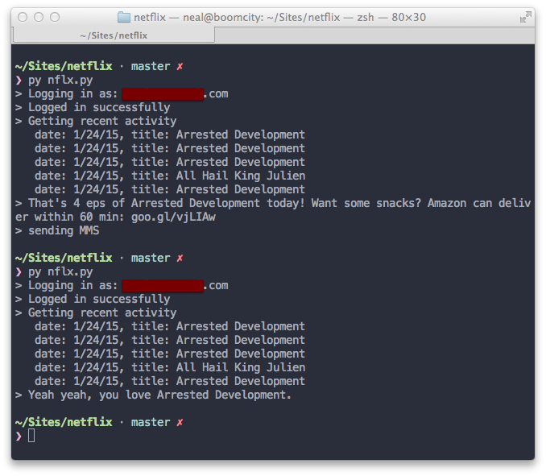

# You marathoning bruh? (YMB)

Netflix marathons are very real --  especially sitting in bed, watching on your tablet. The point of YMB is to identify potential marathon sessions and (in the future) facilitate delivery of 'marathon supplies.'

Author: [Neal Shyam](http://nealshyam.com)  &middot; [@nealrs](http://twitter.com/nealrs)

## Complete

1. Log into Netflix account using Selenium & PhantomJS
2. Parse viewing activity with BeautifulSoup
3. Check if last 3 shows watched are from same series (marathon) and update local tinyDB to avoid repeat triggers on same day.
4. If marathon is detected, send SMS / MMS via Twilio with prompt & link to Amazon Prime Now for SNACK DELIVERY, (which is great for Manhattan / NYC)

  

  _Console output case 1: new marathon detected (with MMS alert) and Case 2: 'old' marathon detected / no alert sent_

  

  _Example of MMS alert with animated GIF (doesen't work on Nexus 5) + link to Amazon Prime Now_

## To do

1. Deep links / API integrations for other apps & APIs 'marathon supplies' (Postmates / Seamless / Delivery.com / Amazon Prime now)
2. Setup cron job that runs every 30 minutes to check marathon status.
3. Add frontend for user registration & hide sensitive user data.

## Installation & Usage

- First, install the dependencies

```
pip install selenium tinydb twilio beautifulsoup4
brew install node
curl https://www.npmjs.org/install.sh | sh
npm install phantomjs
```

- Then, put your Netflix + Twilio login details & API keys into the `keys_ex.py` & rename it `keys.py`

- Uncomment this line in `nflx.py`

```
ds = str(n.month) + "/" + str(n.day) + "/" + str(n.year)[2:]
```

- And finally, run the script 

```
python nflx.py
```